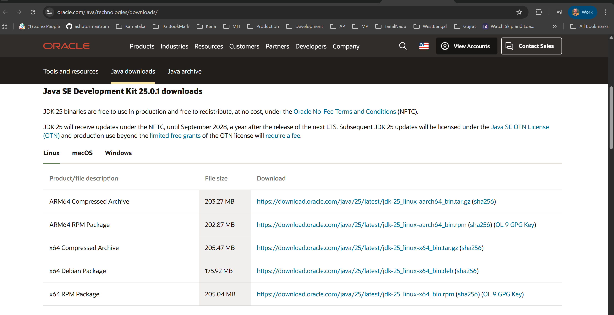

# MediTrack – Java Setup Instructions

## Overview
This document describes the steps to set up the Java environment required to build and run the **MediTrack – Clinic & Appointment Management System** using **Java 21 (JVM 21)**.

---

## System Requirements
- Operating System: Windows
- Java Development Kit (JDK): **Java 21**
- Apache Maven: 3.9+
- Git
- IDE (Optional): IntelliJ IDEA / Eclipse / VS Code

---

## Step 1: Install Java (JDK 21)

1. Download Java 21 from:
    - https://www.oracle.com/java/technologies/javase-downloads.html
   
2. Install the JDK and note the installation path.
3. Set JAVA_HOME Windows
    A. Open Environment Variables
    B. Add a new System Variable:
    C. JAVA_HOME = C:\Program Files\Java\jdk-21
    D. Add to Path: %JAVA_HOME%\bin

4. Restart terminal after setting variables.
5. Open Terminal / Git Bash and run: """java -version""" & ""javac -version"""
    - 
7. Verify or Bash RUN """mvn -version""" Ensure Maven shows Java 21 as the runtime.
8. Java 21 installed successfully.

   

